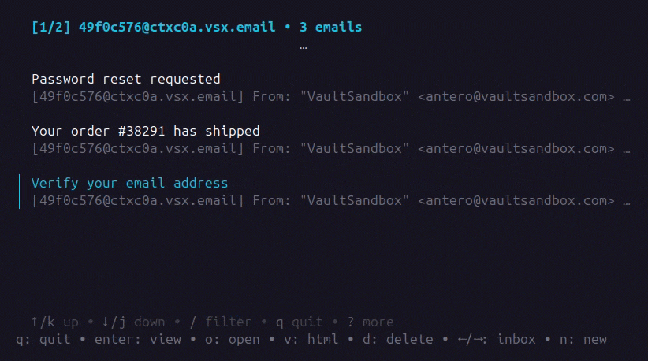
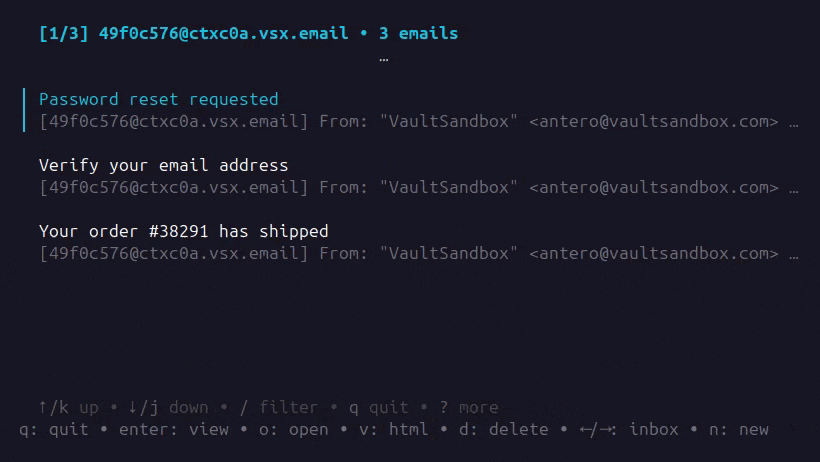

<picture>
  <source media="(prefers-color-scheme: dark)" srcset="./assets/logo-dark.svg">
  <source media="(prefers-color-scheme: light)" srcset="./assets/logo-light.svg">
  
</picture>

# VaultSandbox CLI

[](https://github.com/vaultsandbox/vsb-cli/actions/workflows/ci.yml)
[](https://opensource.org/licenses/Apache-2.0)
[](https://golang.org/)

**Real-time email testing from your terminal.**

A powerful CLI for [VaultSandbox Gateway](https://github.com/vaultsandbox/gateway) — monitor incoming emails in real-time, inspect content, verify authentication, and debug email flows without leaving your terminal.



## Features

- **Interactive TUI Dashboard** — Real-time email monitoring with tabbed views for content, security, links, and attachments
- **Multi-Inbox Watching** — Monitor multiple inboxes simultaneously via SSE streaming
- **Email Authentication** — Instant SPF/DKIM/DMARC validation display
- **Link & Attachment Inspection** — Extract and preview links, open attachments in browser
- **CI/CD Ready** — `wait` command for scripted email testing pipelines
- **Quantum-Safe** — All emails encrypted with ML-KEM-768; decryption happens locally
- **Portable Inboxes** — Export/import inboxes for backup or sharing between environments

## Installation

### Binary Download

Download the latest release for your platform from [GitHub Releases](https://github.com/vaultsandbox/vsb-cli/releases).

```bash
# Linux (amd64)
curl -LO https://github.com/vaultsandbox/vsb-cli/releases/latest/download/vsb_linux_amd64.tar.gz
tar -xzf vsb_linux_amd64.tar.gz
sudo mv vsb /usr/local/bin/

# macOS (Apple Silicon)
curl -LO https://github.com/vaultsandbox/vsb-cli/releases/latest/download/vsb_darwin_arm64.tar.gz
tar -xzf vsb_darwin_arm64.tar.gz
sudo mv vsb /usr/local/bin/
```

### Go Install

```bash
go install github.com/vaultsandbox/vsb-cli/cmd/vsb@latest
```

### Build from Source

```bash
git clone https://github.com/vaultsandbox/vsb-cli.git
cd vsb-cli
go build -o vsb ./cmd/vsb
```

## Quick Start

```bash
# Configure your credentials (stored in ~/.config/vsb/config.yaml)
vsb config set api-key "your-api-key"
vsb config set base-url "https://your-gateway.vsx.email"

# Create an inbox
vsb inbox create

# Launch the TUI dashboard (monitors all your inboxes)
vsb
```

## TUI Dashboard

Run `vsb` without arguments to launch the interactive dashboard. It watches all your stored inboxes in real-time.



### Keyboard Shortcuts

| Key | Action |
|-----|--------|
| `↑` / `k` | Move up |
| `↓` / `j` | Move down |
| `←` / `h` | Previous inbox |
| `→` / `l` | Next inbox |
| `Enter` | View email |
| `o` | Open attachment/link |
| `v` | Open HTML in browser |
| `d` | Delete email |
| `n` | New inbox |
| `/` | Filter emails |
| `?` | Show all shortcuts |
| `q` | Quit |

### Views

| View | Description |
|------|-------------|
| **Content** | Email body (text/HTML), sender, subject, timestamps |
| **Security** | SPF, DKIM, DMARC authentication results |
| **Links** | All URLs extracted from the email |
| **Attachments** | File attachments with size and type |
| **Raw** | Raw email source |

## Commands

### Inbox Management

```bash
# Create a new inbox
vsb inbox create

# Create inbox with custom TTL
vsb inbox create --ttl 24h

# Create inbox without email authentication (skips SPF/DKIM/DMARC checks)
vsb inbox create --email-auth=false

# Create unencrypted inbox (when server policy allows)
vsb inbox create --encryption=plain

# List all inboxes
vsb inbox list

# Show inbox details
vsb inbox info <email-address>

# Set default inbox for commands
vsb inbox use <email-address>

# Delete an inbox
vsb inbox delete <email-address>
```

### Email Operations

```bash
# List emails in default inbox
vsb email list

# List emails in specific inbox
vsb email list --inbox <email-address>

# View email content (defaults to latest)
vsb email view [email-id]

# View email authentication results
vsb email audit [email-id]

# Extract URLs from email
vsb email url [email-id]

# Delete an email
vsb email delete <email-id>

# List attachments
vsb email attachment [email-id]

# Download specific attachment (1 = first)
vsb email attachment [email-id] --save 1

# Download all attachments to directory
vsb email attachment [email-id] --all --dir ./downloads
```

### Waiting for Emails (CI/CD)

The `wait` command blocks until an email matching the criteria arrives — perfect for CI/CD pipelines.

```bash
# Wait for any email (default 60s timeout)
vsb email wait

# Wait with custom timeout
vsb email wait --timeout 30s

# Wait for email with specific subject
vsb email wait --subject "Password Reset"

# Wait for email matching regex
vsb email wait --subject-regex "Verify.*email"

# Wait for email from specific sender
vsb email wait --from "noreply@example.com"

# Wait for sender matching regex
vsb email wait --from-regex ".*@example\.com"

# Wait for multiple emails
vsb email wait --count 3 --timeout 120s

# Extract first link directly
vsb email wait --extract-link

# Output email as JSON for scripting
vsb email wait --json | jq '.links[0]'
```

**Example: CI/CD Pipeline**

```yaml
# GitHub Actions example
- name: Test password reset email
  run: |
    EMAIL=$(vsb inbox create --json | jq -r '.email')
    curl -X POST https://myapp.com/reset-password -d "email=$EMAIL"
    RESET_LINK=$(vsb email wait --subject-regex "Reset" --json | jq -r '.links[0]')
    curl -I "$RESET_LINK" | grep "200 OK"
```

### Import/Export

```bash
# Export inbox (includes private keys - treat as secret!)
vsb export <email-address> --out inbox-backup.json

# Import inbox
vsb import inbox-backup.json
```

### Configuration

```bash
# Show current configuration
vsb config show

# Set configuration values
vsb config set api-key "your-api-key"
vsb config set base-url "https://your-gateway.vsx.email"
vsb config set strategy sse        # or "polling"

# Interactive strategy selection
vsb config set strategy
```

## Configuration

Configuration is loaded in order of priority:

1. **Environment variables** — `VSB_API_KEY`, `VSB_BASE_URL`
2. **Config file** — `~/.config/vsb/config.yaml`

### Config File

```yaml
# ~/.config/vsb/config.yaml
api_key: your-api-key
base_url: https://your-gateway.vsx.email
strategy: sse  # "sse" (default) or "polling"
```

### Environment Variables

| Variable | Description |
|----------|-------------|
| `VSB_API_KEY` | Your VaultSandbox API key |
| `VSB_BASE_URL` | Gateway URL |
| `VSB_STRATEGY` | Delivery strategy: `sse` (default) or `polling` |

## Data Storage

The CLI stores data locally:

| Path | Contents |
|------|----------|
| `~/.config/vsb/config.yaml` | Configuration |
| `~/.config/vsb/keystore.json` | Inbox private keys (treat as secret!) |

## Security

- **Encrypted at Rest** — The gateway receives emails via SMTP, encrypts them with your public key, and stores only ciphertext
- **Local Decryption** — Only your CLI can decrypt emails using the private keys in your keystore
- **Quantum-Safe** — ML-KEM-768 (Kyber) encryption protects against future quantum attacks
- **Signature Verification** — All data is verified before decryption to prevent tampering

See [SECURITY.md](SECURITY.md) for the full security model.

## Requirements

- VaultSandbox Gateway server
- Valid API key

## Related

- [VaultSandbox Gateway](https://github.com/vaultsandbox/gateway) — The self-hosted SMTP server
- [VaultSandbox Go Client](https://github.com/vaultsandbox/client-go) — Go SDK for programmatic access
- [VaultSandbox Documentation](https://vaultsandbox.dev) — Full documentation and guides

## Support

- [Documentation](https://vaultsandbox.dev/cli/)
- [Issue Tracker](https://github.com/vaultsandbox/vsb-cli/issues)
- [Discussions](https://github.com/vaultsandbox/gateway/discussions)
- [Website](https://www.vaultsandbox.com)

## Contributing

Contributions are welcome! Please read our [contributing guidelines](CONTRIBUTING.md) before submitting PRs.

## License

Apache 2.0 — see [LICENSE](LICENSE) for details.
